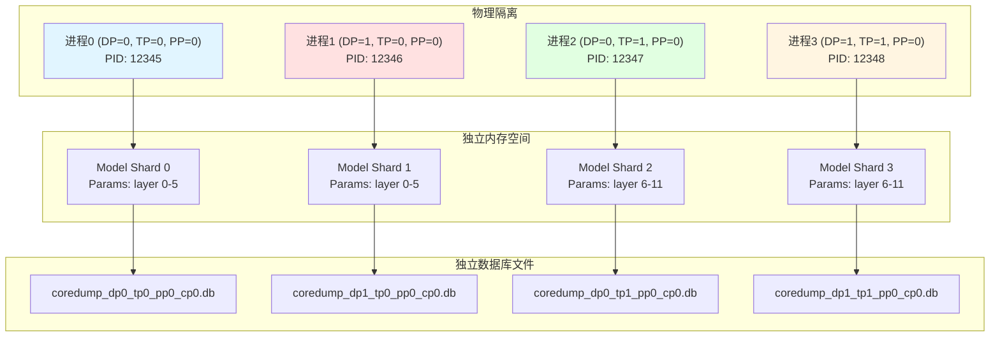
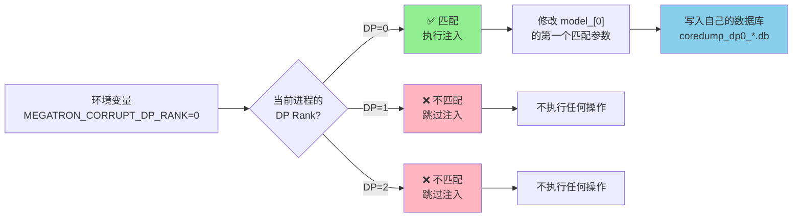
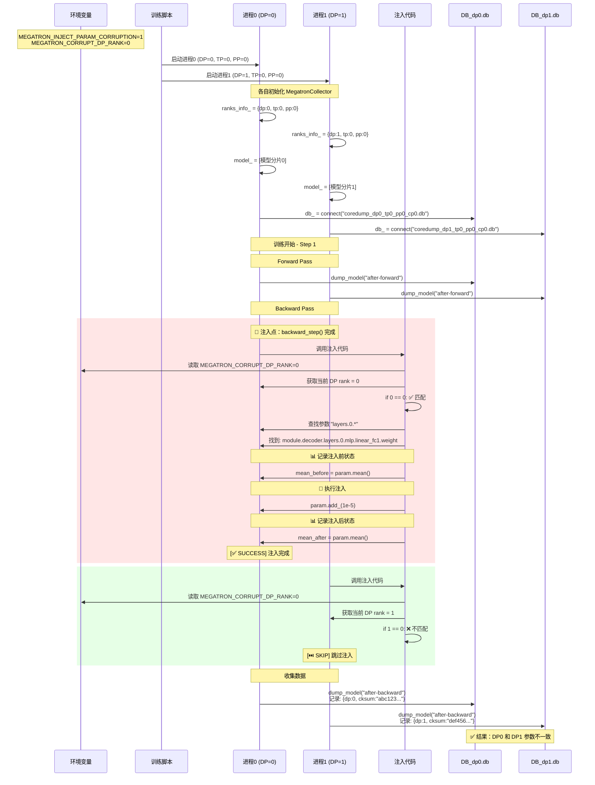
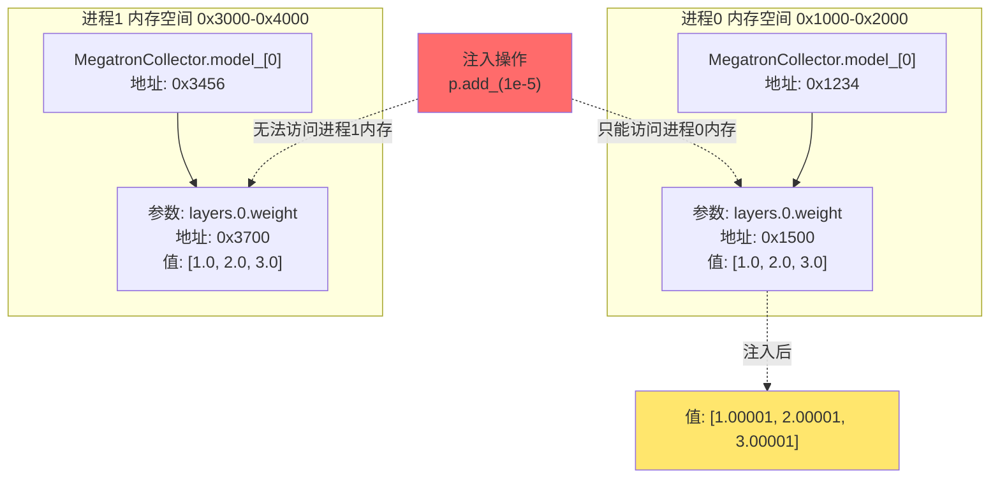
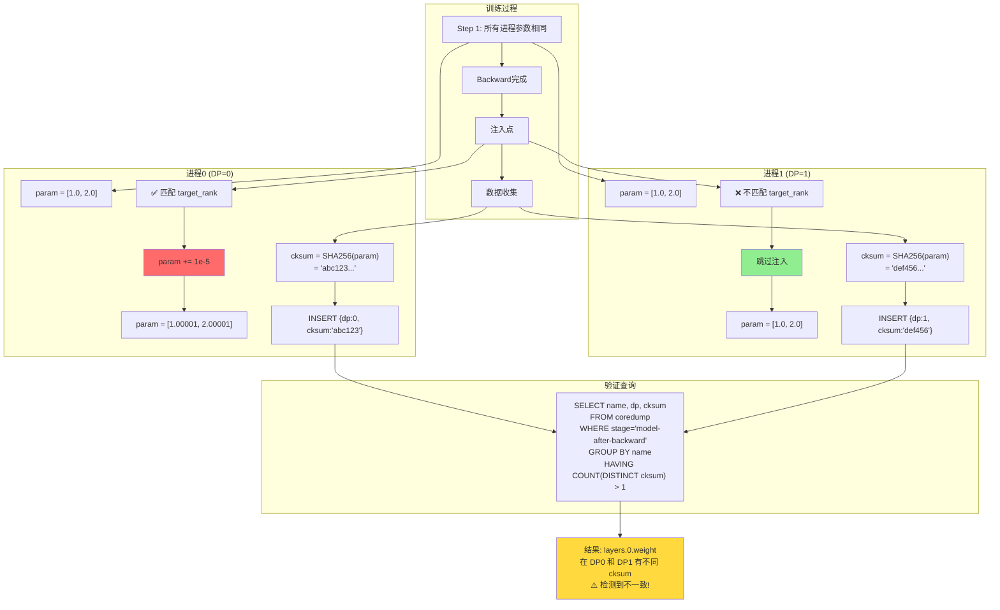
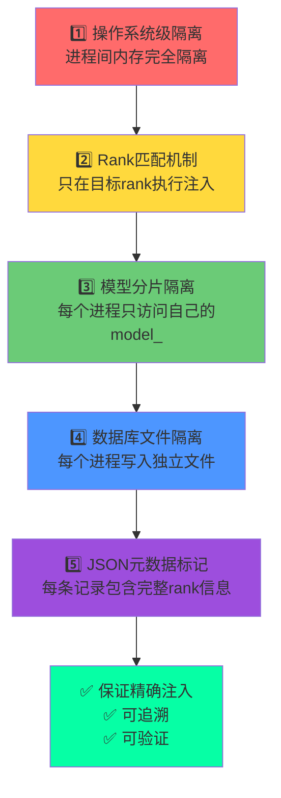

# 错误注入架构分析：如何保证注入精确性

## 🎯 核心问题

**问题**: 注入过程如何知道自己当前注入的是哪个进程的参数，不会注入乱掉？

**答案**: 通过**多层隔离机制**和**严格的数据结构设计**确保每个进程只注入自己的参数。

---

## 📊 数据结构设计

### 1. MegatronCollector 数据结构

```python
class MegatronCollector:
    # ===== 全局状态（类级别，所有进程共享相同的类定义但数据独立）=====
    step_: int = 0                    # 当前训练步数（每个进程独立维护）
    dump_step_: int                   # 从环境变量读取，所有进程相同
    
    # ===== 核心组件（每个进程独立）=====
    model_: List[torch.nn.Module]    # 当前进程的模型分片
    optimizer_: Optimizer             # 当前进程的优化器
    scheduler_: LRScheduler           # 当前进程的学习率调度器
    
    # ===== 进程标识（每个进程独立）=====
    ranks_info_: Dict[str, int] = {
        "dp": <data_parallel_rank>,      # 数据并行 rank (0, 1, ...)
        "tp": <tensor_parallel_rank>,    # 张量并行 rank (0, 1, ...)
        "pp": <pipeline_parallel_rank>,  # 流水线并行 rank (0, 1, ...)
        "cp": <context_parallel_rank>,   # 上下文并行 rank (0, 1, ...)
        "ep": <expert_parallel_rank>,    # 专家并行 rank (0, 1, ...)
        "etp": <expert_tensor_parallel>  # 专家张量并行 rank
    }
    
    # ===== 数据库连接（每个进程独立的数据库文件）=====
    db_: duckdb.Connection
    # 文件名: coredump_dp{dp}_tp{tp}_pp{pp}_cp{cp}.db
```

### 2. 数据库记录结构

```sql
CREATE TABLE coredump (
    step INTEGER,      -- 训练步数
    stage TEXT,        -- 阶段标识（如 "model-after-backward"）
    data JSON          -- 参数数据（包含完整的 rank 信息）
);

-- JSON data 结构示例
{
    "name": "module.decoder.layers.0.mlp.linear_fc1.weight",  -- 参数名
    "cksum": "a1b2c3d4...",                                    -- SHA256 校验和
    "shape": [128, 320],                                       -- 参数形状
    "type": "torch.bfloat16",                                  -- 数据类型
    "dp": 0,                                                   -- DP rank（来自 ranks_info_）
    "tp": 0,                                                   -- TP rank
    "pp": 0,                                                   -- PP rank
    "cp": 0,                                                   -- CP rank
    "ep": 0,                                                   -- EP rank
    "etp": 0                                                   -- ETP rank
}
```

---

## 🔒 隔离机制设计

### 机制1: 进程级别隔离



**关键点**:
- ✅ 每个进程有独立的内存地址空间
- ✅ 每个进程有独立的 `MegatronCollector.model_` 引用
- ✅ 每个进程写入独立的数据库文件
- ✅ **操作系统保证进程间内存完全隔离**

### 机制2: Rank 匹配机制



**关键代码**:
```python
# schedules.py line 465-489
target_dp_rank = int(os.getenv("MEGATRON_CORRUPT_DP_RANK", "0"))
dp_rank = MegatronCollector.ranks_info_.get("dp", -1)

# 只有当前进程的 DP rank 匹配时才注入
if dp_rank == target_dp_rank:
    # 只修改当前进程的模型参数
    for pname, p in MegatronCollector.model_[0].named_parameters():
        if param_substr is None or param_substr in pname:
            p.add_(delta)  # 只修改当前进程内存中的参数
            break
```

---

## 🔄 完整的注入流程

### 流程图



### 关键时间点

| 时间点 | 进程0 (DP=0) | 进程1 (DP=1) | 说明 |
|--------|--------------|--------------|------|
| T0 | 初始化 ranks_info={dp:0} | 初始化 ranks_info={dp:1} | 各自获取自己的 rank |
| T1 | model_=模型分片0 | model_=模型分片1 | 模型参数相同（初始化后） |
| T2 | Forward pass | Forward pass | 参数仍然相同 |
| T3 | Backward pass | Backward pass | 参数仍然相同 |
| T4 | **注入 param+=1e-5** | **跳过注入** | ⚠️ 此时产生不一致 |
| T5 | dump: cksum=abc123 | dump: cksum=def456 | 记录到不同数据库 |

---

## 🛡️ 安全性保证

### 1. 内存隔离



**操作系统保证**:
- ✅ 进程0 **无法访问** 进程1 的内存地址
- ✅ 注入操作 `p.add_(1e-5)` 只能修改当前进程的参数
- ✅ 即使想乱注入也做不到（受操作系统保护）

### 2. 数据库文件隔离

```
文件系统布局:
/savedb/Collector/
├── coredump_dp0_tp0_pp0_cp0.db  ← 进程0写入
├── coredump_dp1_tp0_pp0_cp0.db  ← 进程1写入
├── coredump_dp0_tp1_pp0_cp0.db  ← 进程2写入
└── coredump_dp1_tp1_pp0_cp0.db  ← 进程3写入
```

**文件隔离机制**:
```python
# megatron_collector.py line 59
db_path = os.path.join(
    root_dir,
    f"Collector/coredump_dp{cls.ranks_info_['dp']}_"
    f"tp{cls.ranks_info_['tp']}_pp{cls.ranks_info_['pp']}_"
    f"cp{cls.ranks_info_['cp']}.db"
)
cls.db_ = duckdb.connect(db_path)
```

- ✅ 每个进程根据自己的 `ranks_info_` 连接到独立文件
- ✅ 文件名包含完整的 rank 信息
- ✅ 不同进程**无法写入对方的数据库文件**

---

## 🔍 验证不一致的原理

### 数据流图



### SQL验证逻辑

```sql
-- 查询不一致的参数
WITH param_checksums AS (
    SELECT 
        JSON_EXTRACT_STRING(data, '$.name') as param_name,
        JSON_EXTRACT_STRING(data, '$.dp') as dp_rank,
        JSON_EXTRACT_STRING(data, '$.cksum') as cksum
    FROM coredump
    WHERE stage = 'model-after-backward'
        AND step = 1
)
SELECT 
    param_name,
    COUNT(DISTINCT cksum) as different_checksums,
    ARRAY_AGG(DISTINCT dp_rank) as dp_ranks,
    ARRAY_AGG(DISTINCT cksum) as checksums
FROM param_checksums
GROUP BY param_name
HAVING COUNT(DISTINCT cksum) > 1;

-- 结果示例:
-- param_name                                    | different_checksums | dp_ranks | checksums
-- --------------------------------------------- | ------------------- | -------- | ---------
-- module.decoder.layers.0.mlp.linear_fc1.weight | 2                   | [0, 1]   | [abc123, def456]
--                                                                       ↑         ↑
--                                                                  DP0被注入    不同的校验和
```

---

## 🎯 总结：为什么不会注入乱掉？

### 五层保证机制



### 关键设计原则

| 层级 | 机制 | 作用 | 失败后果 |
|------|------|------|----------|
| **操作系统** | 进程隔离 | 物理内存隔离 | 无法访问其他进程内存（Segmentation Fault） |
| **应用逻辑** | Rank匹配 | 逻辑判断过滤 | 跳过注入，不会误操作 |
| **对象引用** | model_ 分片 | 每个进程独立引用 | 只能修改自己的参数 |
| **文件系统** | 独立DB文件 | 基于rank命名隔离 | 写入不同文件，不会混淆 |
| **数据标记** | JSON metadata | 记录完整上下文 | 可追溯、可验证 |

---

## 📖 实际运行示例

假设：2个GPU，DP=2, TP=1, PP=1，注入配置 `MEGATRON_CORRUPT_DP_RANK=0`

```
GPU 0 (进程0):
  ├─ ranks_info_ = {dp:0, tp:0, pp:0}
  ├─ model_[0] 包含完整模型
  ├─ 注入前: layers.0.weight = [1.234, 2.345, ...]
  ├─ 注入判断: dp_rank(0) == target(0) ? ✅ 是
  ├─ 执行注入: layers.0.weight += 1e-5
  ├─ 注入后: layers.0.weight = [1.23401, 2.34501, ...]
  ├─ 计算cksum: SHA256 = "abc123..."
  └─ 写入: coredump_dp0_tp0_pp0_cp0.db
           INSERT {dp:0, name:"layers.0.weight", cksum:"abc123"}

GPU 1 (进程1):
  ├─ ranks_info_ = {dp:1, tp:0, pp:0}
  ├─ model_[0] 包含完整模型
  ├─ 注入前: layers.0.weight = [1.234, 2.345, ...]
  ├─ 注入判断: dp_rank(1) == target(0) ? ❌ 否
  ├─ 跳过注入
  ├─ 参数不变: layers.0.weight = [1.234, 2.345, ...]
  ├─ 计算cksum: SHA256 = "def456..."
  └─ 写入: coredump_dp1_tp0_pp0_cp0.db
           INSERT {dp:1, name:"layers.0.weight", cksum:"def456"}

验证查询:
  SELECT name FROM coredump 
  WHERE name='layers.0.weight' 
  GROUP BY name 
  HAVING COUNT(DISTINCT cksum) > 1
  
  结果: ✅ 检测到不一致（abc123 != def456）
```

---

**结论**: 通过操作系统级隔离、逻辑判断、独立数据库文件和完整元数据标记的**多层保证机制**，确保注入过程**精确、可控、可追溯**，不会产生混乱。


